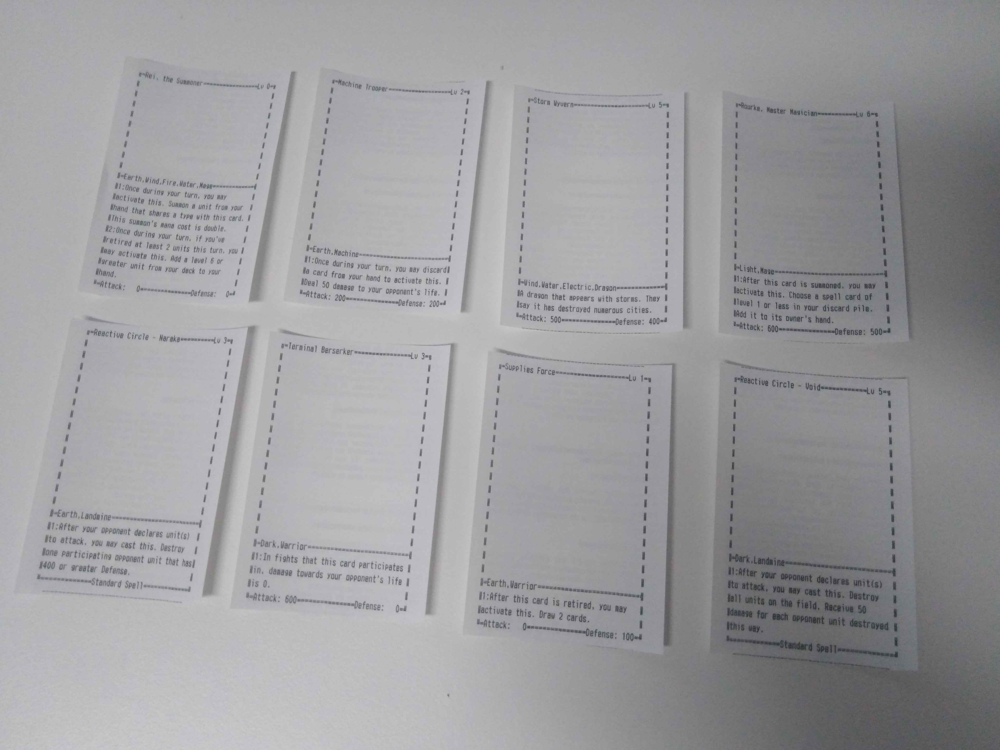
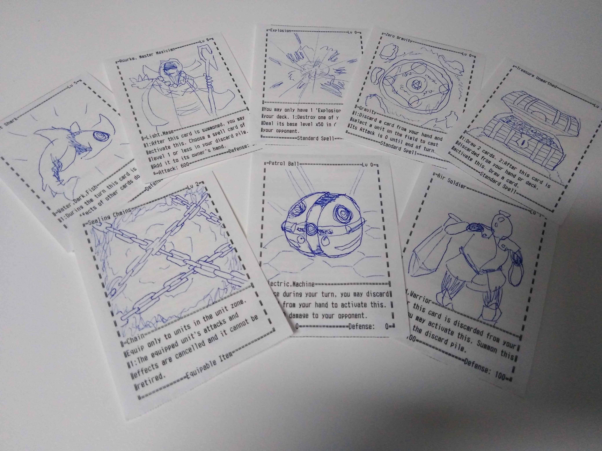

# Receipt-Cards
This prints [Cross Universe](https://crossuniverse.net/jp) decks on a receipt printer, using [the python escpos library](https://github.com/python-escpos/python-escpos), like so:

Currently, the ZJ-5890T is the only supported printer - if you have a different printer, feel free to add support for it.  
And since the ZJ-5890T can't print images, you'll also have to draw those yourself after printing, somewhat like this:

## How to Print
Here's how you print the included example deck.  
If you want to print other decks, you can get some on [crossuniverse.net](https://crossuniverse.net) or make your own with [Cross Universe Online](https://battle.crossuniverse.net/deckMaker/index.html).

### Setup
1. Download this repo if you haven't already.
2. Install python3.
3. Install [the python escpos library](https://github.com/python-escpos/python-escpos) with `python3 -m pip install escpos`.
4. If you're on Windows, you might need to download a more up-to-date [libusb](https://libusb.info/) and drop the dll in your System32 folder.

### Printing
1. Plug in your printer.
2. Run `python3 print.py 'Starter Deck.deck'` in a Terminal in this folder.

You can replace 'Starter Deck.deck' with the path to whatever deck file you want to print.

## Why does this need the internet to print?
This uses the [crossuniverse.net API](https://crossuniverse.net/apiDocs/) to automatically fetch the up-to-date card text when printing and to do that, it needs the internet.

## License
All code in this repo is under the MIT license, so have fun with it.
